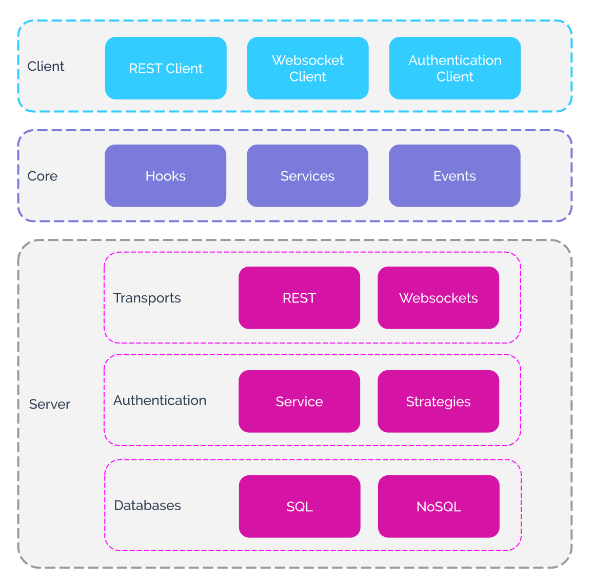

# API

This section describes all the individual modules and APIs of Feathers. There are three main sections of the API:

- __Core:__ The Feathers core functionality that can be used on the server and the client
- __Server:__ Feathers server side modules used with Core when creating an API server in NodeJS
- __Client:__ Modules used on the client (NodeJS, browser or React Native) together with Core when connecting to a Feathers API server.

 Here is an overview how the individual sections of the API documentation fit together:

## Core

Feathers core functionality that works on the client and the server

* [Application](application.md) - The main Feathers application API
* [Services](services.md) - Service objects and their methods and Feathers specific functionality
* [Hooks](hooks.md) - Pluggable middleware for service  methods
* [Events](events.md) - Events sent by Feathers service methods
* [Errors](errors.md) - A collection of error classes used throughout Feathers

## Transports

Expose a Feathers application as an API server
  * [Koa](koa.md) - Feathers KoaJS framework bindings, REST API provider and error middleware.
  * [Express](express.md) - Feathers Express framework bindings, REST API provider and error middleware.
  * [Socket.io](socketio.md) - The Socket.io real-time transport provider
  * [Configuration](configuration.md) - A node-config wrapper to initialize configuration of a server side application.
  * [Channels](channels.md) - Decide what events to send to connected real-time clients

## Client

More details on how to use Feathers on the client

* [Usage](client.md) - Feathers client usage in Node, React Native and the browser (also with Webpack and Browserify)
* [REST](client/rest.md) - Feathers client and direct REST API server usage
* [Socket.io](client/socketio.md) - Feathers client and direct Socket.io API server usage

## Authentication

Feathers authentication mechanism

* [Service](authentication/service.md) - The main authentication service configuration
* [Strategies](authentication/strategy.md) - More about authentication strategies
* [Local](authentication/local.md) - Local email/password authentication
* [JWT](authentication/jwt.md) - JWT authentication
* [OAuth](authentication/oauth.md) - Using OAuth logins (Facebook, Twitter etc.)
* [Client](authentication/client.md) - A client for a Feathers authentication server

## Databases

Feathers common database adapter API and querying mechanism

* [Adapters](databases/adapters.md) - A list of supported database adapters
* [Common API](databases/common.md) - Database adapter common initialization and configuration API
* [Querying](databases/querying.md) - The common querying mechanism
