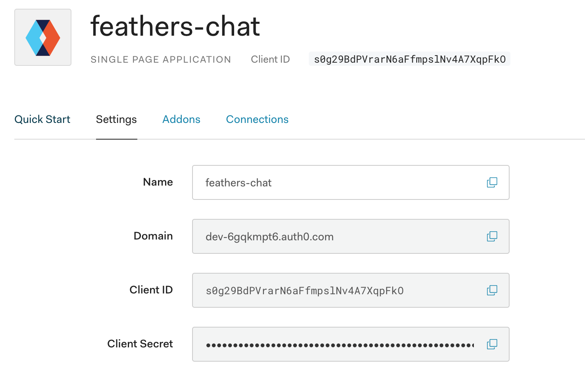

# Auth0

To enable OAuth logins with [Auth0](http://auth0.com), we need the following settings after creating an application:



This should be added in your configuration (usually `config/default.json`) as follows:

```json
"authentication": {
  "oauth": {
    "redirect": "/",
    "auth0": {
      "key": "<Client ID>",
      "secret": "<Client Secret>",
      "subdomain": "<Domain without auth0.com",
      "scope": ["openid", "profile", "email"]
    }
  }
}
```

> __Important:__ `subdomain` should be the "Domain" from the application settings __without__ the `auth0.com` part. So, in the screenshot above, the subdomain for `dev-6gqkmpt6.auth0.com` would be `dev-6gqkmpt6`. If the subdomain includes a region, it needs to be included as well so the subdomain for `dev-6gqkmpt6.us.auth0.com` would be `dev-6gqkmpt6.us`

## Strategy

To use Auth0 in the chat application from the [Feathers guide](../../guides/) we have to do the same modifications as already shown [for the GitHub login in the authentication guide](../../guides/basics/authentication.md).

:::: tabs :options="{ useUrlFragment: false }"
::: tab "JavaScript"

In `src/authentication.js` like this:

```js
const { AuthenticationService, JWTStrategy } = require('@feathersjs/authentication');
const { LocalStrategy } = require('@feathersjs/authentication-local');
const { expressOauth, OAuthStrategy } = require('@feathersjs/authentication-oauth');

class Auth0Strategy extends OAuthStrategy {
  async getEntityData(profile) {
    const baseData = await super.getEntityData(profile);

    return {
      ...baseData,
      email: profile.email
    };
  }
}

module.exports = app => {
  const authentication = new AuthenticationService(app);

  authentication.register('jwt', new JWTStrategy());
  authentication.register('local', new LocalStrategy());
  authentication.register('auth0', new Auth0Strategy());

  app.use('/authentication', authentication);
  app.configure(expressOauth());
};
```
:::
::: tab "TypeScript"
In `src/authentication.ts` like this:

```ts
import { ServiceAddons, Params } from '@feathersjs/feathers';
import { AuthenticationService, JWTStrategy } from '@feathersjs/authentication';
import { LocalStrategy } from '@feathersjs/authentication-local';
import { expressOauth, OAuthStrategy, OAuthProfile } from '@feathersjs/authentication-oauth';

import { Application } from './declarations';

declare module './declarations' {
  interface ServiceTypes {
    'authentication': AuthenticationService & ServiceAddons<any>;
  }
}

class Auth0Strategy extends OAuthStrategy {
  async getEntityData(profile: OAuthProfile, existing: any, params: Params) {
    const baseData = await super.getEntityData(profile, existing, params);

    return {
      ...baseData,
      email: profile.email
    };
  }
}

export default function(app: Application) {
  const authentication = new AuthenticationService(app);

  authentication.register('jwt', new JWTStrategy());
  authentication.register('local', new LocalStrategy());
  authentication.register('auth0', new Auth0Strategy());

  app.use('/authentication', authentication);
  app.configure(expressOauth());
}
```
:::
::::

Additionally, `auth0Id` needs to be included in the data in the users service class.
