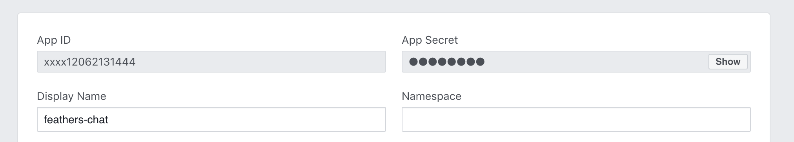

# Facebook

Facebook login can be initialized like any other [OAuth provider](../../api/authentication/oauth.md) by adding the app id and secret to `config/default.json`:

```js
{
  "authentication": {
    "oauth": {
      "facebook": {
        "key": "<App ID>",
        "secret": "<App Secret>"
      }
    }
  }
}
```

Requesting the email property requires adding additional `scope` to the oauth configuration:
```js
{
  "authentication": {
    "oauth": {
      "facebook": {
        "key": "<App ID>",
        "secret": "<App Secret>",
        "scope": ["email, public_profile"]
      }
    }
  }
}
```

## Application client and secret

The client id (App ID) and secret can be found in the Settings of the [Facebook app](https://developers.facebook.com/apps):



## Getting profile data

The standard OAuth strategy only returns the default profile fields (`id` and `name`). To get other fields, like the email or profile picture, the [getProfile](../../api/authentication/oauth.md#getprofile-data-params) method of the [OAuth strategy needs to be customized](../../api/authentication/oauth.md#customization) to call the Graph API profile endpoint `https://graph.facebook.com/me` with an HTTP request library like [Axios](https://developers.facebook.com/tools/explorer/) requesting the additional fields.

> __Pro tip:__ Facebook API requests can be tested via the [Graph API explorer](https://developers.facebook.com/tools/explorer/).

The following example allows to log in with Facebook in the [chat application from the guide](../../guides/index.md):


<LanguageBlock global-id="ts">

```ts
import { Params } from '@feathersjs/feathers';
import { AuthenticationService, JWTStrategy, AuthenticationRequest } from '@feathersjs/authentication';
import { LocalStrategy } from '@feathersjs/authentication-local';
import { expressOauth, OAuthStrategy, OAuthProfile } from '@feathersjs/authentication-oauth';
import axios from 'axios';
import { Application } from './declarations';

declare module './declarations' {
  interface ServiceTypes {
    'authentication': AuthenticationService & ServiceAddons<any>;
  }
}

class FacebookStrategy extends OAuthStrategy {
  async getProfile (authResult: AuthenticationRequest, _params: Params) {
    // This is the OAuth access token that can be used
    // for Facebook API requests as the Bearer token
    const accessToken = authResult.access_token;

    const { data } = await axios.get('https://graph.facebook.com/me', {
      headers: {
        authorization: `Bearer ${accessToken}`
      },
      params: {
        // There are
        fields: 'id,name,email'
      }
    });

    return data;
  }

  async getEntityData(profile: OAuthProfile, existing: any, params: Params) {
    // `profile` is the data returned by getProfile
    const baseData = await super.getEntityData(profile, existing, params);

    return {
      ...baseData,
      email: profile.email
    };
  }
}

export default function(app: Application) {
  const authentication = new AuthenticationService(app);

  authentication.register('jwt', new JWTStrategy());
  authentication.register('local', new LocalStrategy());
  authentication.register('facebook', new FacebookStrategy());

  app.use('/authentication', authentication);
  app.configure(expressOauth());
}
```

</LanguageBlock>

<LanguageBlock global-id="js">

In `src/authentication.js`:

```js
const axios = require('axios');
const { AuthenticationService, JWTStrategy } = require('@feathersjs/authentication');
const { LocalStrategy } = require('@feathersjs/authentication-local');
const { expressOauth, OAuthStrategy } = require('@feathersjs/authentication-oauth');

class FacebookStrategy extends OAuthStrategy {
  async getProfile (authResult) {
    // This is the OAuth access token that can be used
    // for Facebook API requests as the Bearer token
    const accessToken = authResult.access_token;

    const { data } = await axios.get('https://graph.facebook.com/me', {
      headers: {
        authorization: `Bearer ${accessToken}`
      },
      params: {
        // There are
        fields: 'id,name,email,picture'
      }
    });

    return data;
  }

  async getEntityData(profile) {
    // `profile` is the data returned by getProfile
    const baseData = await super.getEntityData(profile);

    return {
      ...baseData,
      name:  profile.name,
      email: profile.email
    };
  }
}

module.exports = app => {
  const authentication = new AuthenticationService(app);

  authentication.register('jwt', new JWTStrategy());
  authentication.register('local', new LocalStrategy());
  authentication.register('facebook', new FacebookStrategy());

  app.use('/authentication', authentication);
  app.configure(expressOauth());
};
```

</LanguageBlock>


> __Pro tip:__ [See all available Facebook user options here](https://developers.facebook.com/docs/graph-api/reference/user/).
