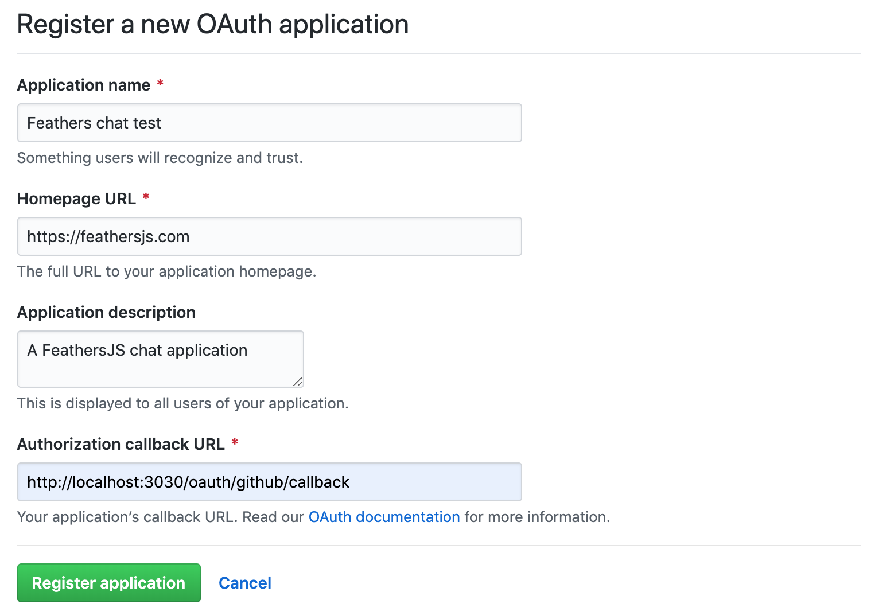

# Authentication

We now have a fully functional chat application consisting of [services](./services.md) and [hooks](./hooks.md). The services come with authentication enabled by default, so before we can use it we need to create a new user and learn how Feathers authentication works. We will look at authenticating our REST API, and then how to authenticate with Feathers in the browser. Finally, we will discuss how to add "Login with GitHub" functionality using OAuth 2.0.

## Registering a user

Although the frontend we will create [in the next chapter](./frontend.md) will allow to register new users, let's have a quick look at how the REST API can be used directly to register a new user. We can do this by sending a POST request to `http://localhost:3030/users` with JSON data like this as the body:

```js
// POST /users
{
  "email": "hello@feathersjs.com",
  "password": "supersecret"
}
```

Try it:

```sh
curl 'http://localhost:3030/users/' \
  -H 'Content-Type: application/json' \
  --data-binary '{ "email": "hello@feathersjs.com", "password": "supersecret" }'
```

[](https://app.getpostman.com/run-collection/6bcea48aac6c7494c2ad)

> __Note:__ Creating a user with the same email address will only work once, then fail since it already exists in the database.

This will return something like this:

```json
{
  "_id": "<random id>",
  "email": "hello@feathersjs.com",
  "avatar": "https://s.gravatar.com/avatar/ffe2a09df37d7c646e974a2d2b8d3e03?s=60"  
}
```

Which means our user has been created successfully.

> __Note:__ The password is stored securely in the database but will never be included in a response to an external client.

## Get a token

By default, Feathers uses [JSON web token](https://jwt.io/) for authentication. It is an access token that is valid for a limited time (one day by default) that is issued by the Feathers server and needs to be sent with every API request that requires authentication. Usually a token is issued for a specific user and in our case we want a JWT for the user we just created.

> __Pro tip:__ If you are wondering why Feathers is using JWT for authentication, have a look at [this FAQ](../../help/faq.md#why-are-you-using-jwt-for-sessions).

Tokens can be created by sending a POST request to the `/authentication` endpoint (which is the same as calling the `create` method on the `authentication` service set up in `src/authentication`) and passing the authentication strategy you want to use. To get a token for an existing user through a username (email) and password login we can use the built-in `local` authentication strategy with a request like this:

```js
// POST /authentication
{
  "strategy": "local",
  "email": "hello@feathersjs.com",
  "password": "supersecret"
}
```

Try it:

```sh
curl 'http://localhost:3030/authentication/' \
  -H 'Content-Type: application/json' \
  --data-binary '{ "strategy": "local", "email": "hello@feathersjs.com", "password": "supersecret" }'
```

[](https://app.getpostman.com/run-collection/6bcea48aac6c7494c2ad)

This will return something like this:

```json
{
  "accessToken": "<JWT for this user>",
  "authentication": {
    "strategy":"local"
  },
  "user":{
    "_id":"<user id>",
    "email":"hello@feathersjs.com",
    "avatar":"https://s.gravatar.com/avatar/ffe2a09df37d7c646e974a2d2b8d3e03?s=60",
  }
}
```

The `accessToken` can now be used for other REST requests that require authentication by sending the `Authorization: Bearer <JWT for this user>` HTTP header.

> __Pro tip:__ For more information about the direct usage of the REST API see the [REST client API](../../api/client/rest.md) and for websockets the [Socket.io client API](../../api/client/socketio.md).

## Browser authentication

When using Feathers on the client, the authentication client does all those authentication steps for us automatically. It stores the access token as long as it is valid so that a user does not have to log in every time they visit our site and sends it with every request. It also takes care of making sure that the user is always authenticated again, for example after they went offline for a bit. Since we will need it in the [building a frontend chapter](./frontend.md) anyway, let's update the existing `public/index.html` file like this:

```html
<html lang="en">
  <head>
    <meta http-equiv="content-type" content="text/html; charset=utf-8">
    <meta name="viewport"
      content="width=device-width, initial-scale=1.0, maximum-scale=1, user-scalable=0" />
    <title>FeathersJS chat</title>
    <link rel="shortcut icon" href="favicon.ico">
    <link rel="stylesheet" href="//unpkg.com/feathers-chat@4.0.0/public/base.css">
    <link rel="stylesheet" href="//unpkg.com/feathers-chat@4.0.0/public/chat.css">
  </head>
  <body>
    <div id="app" class="flex flex-column"></div>
    <script src="//cdnjs.cloudflare.com/ajax/libs/moment.js/2.12.0/moment.js"></script>
    <script src="//unpkg.com/@feathersjs/client@^4.3.0/dist/feathers.js"></script>
    <script src="/socket.io/socket.io.js"></script>
    <script src="client.js"></script>
  </body>
</html>
```

Create a new file `public/client.js` where we can now set up the Feathers client similar to the [getting started example](./starting.md). We also add a `login` method that first tries to use a stored token by calling `app.reAuthenticate()`. If that fails, we try to log in with email/password of our registered user:

```js
// Establish a Socket.io connection
const socket = io();

// Initialize our Feathers client application through Socket.io
// with hooks and authentication.
const client = feathers();
client.configure(feathers.socketio(socket));

// Use localStorage to store our login token
client.configure(feathers.authentication({
  storage: window.localStorage
}));

const login = async () => {
  try {
    // First try to log in with an existing JWT
    return await client.reAuthenticate();
  } catch (error) {
    // If that errors, log in with email/password
    // Here we would normally show a login page
    // to get the login information
    return await client.authenticate({
      strategy: 'local',
      email: 'hello@feathersjs.com',
      password: 'supersecret'
    });
  }
};

const main = async () => {
  const auth = await login();

  console.log('User is authenticated', auth);

  // Log us out again
  await client.logout();
};

main();
```

If you now open the console and visit [localhost:3030](http://localhost:3030) you will see that our user has been authenticated.

## GitHub login (OAuth)

OAuth is an open authentication standard supported by almost every major platform. It is what is being used by the login with Facebook, Google, GitHub etc. buttons in a web application. From the Feathers perspective the authentication flow is pretty similar. Instead of authenticating with the `local` strategy by sending a username and password, we direct the user to authorize the application with the login provider. If it is successful we find or create the user on the `users` service with the information we got back from the provider and issue a token for them.

Let's use GitHub as an example for how to set up a "Login with GitHub" button. First, we have to [create a new OAuth application on GitHub](https://github.com/settings/applications/new). You can put anything in the name, homepage and description fields. The callback URL __must__ be set

```sh
http://localhost:3030/oauth/github/callback
```



> __Note:__ You can find your existing applications in the [GitHub OAuth apps developer settings](https://github.com/settings/developers).

Once you clicked "Register application" we have to update our Feathers app configuration with the client id and secret copied from the GitHub application settings:


Find the `authentication` section in `config/default.json` add a configuration section like this:

```js
{
  "authentication": {
    "oauth": {
      "redirect": "/",
      "github": {
        "key": "<Client ID>",
        "secret": "<Client Secret>"
      }
    },
    // Other authentication configuration is here
    // ...
  }
}
```

This tells the OAuth strategy to redirect back to our index page after a successful login and already makes a basic login with GitHub possible. Because of the changes we made in the `users` service in the [services chapter](./services.md) we do need a small customization though. Instead of only adding `githubId` to a new user when they log in with GitHub we also include their email (if it is available), the display name to show in the chat and the avatar image from the profile we get back. We can do this by extending the standard OAuth strategy and registering it as a GitHub specific one and overwriting the `getEntityData` method:

:::: tabs :options="{ useUrlFragment: false }"
::: tab "JavaScript"
Update `src/authentication.js` as follows:

```js
const { AuthenticationService, JWTStrategy } = require('@feathersjs/authentication');
const { LocalStrategy } = require('@feathersjs/authentication-local');
const { expressOauth, OAuthStrategy } = require('@feathersjs/authentication-oauth');

class GitHubStrategy extends OAuthStrategy {
  async getEntityData(profile) {
    const baseData = await super.getEntityData(profile);

    return {
      ...baseData,
      // You can also set the display name to profile.name
      name: profile.login,
      // The GitHub profile image
      avatar: profile.avatar_url,
      // The user email address (if available)
      email: profile.email
    };
  }
}

module.exports = app => {
  const authentication = new AuthenticationService(app);

  authentication.register('jwt', new JWTStrategy());
  authentication.register('local', new LocalStrategy());
  authentication.register('github', new GitHubStrategy());

  app.use('/authentication', authentication);
  app.configure(expressOauth());
};
```
:::
::: tab "TypeScript"
Update `src/authentication.ts` as follows:

```ts
import { ServiceAddons, Params } from '@feathersjs/feathers';
import { AuthenticationService, JWTStrategy } from '@feathersjs/authentication';
import { LocalStrategy } from '@feathersjs/authentication-local';
import { expressOauth, OAuthStrategy, OAuthProfile } from '@feathersjs/authentication-oauth';

import { Application } from './declarations';

declare module './declarations' {
  interface ServiceTypes {
    'authentication': AuthenticationService & ServiceAddons<any>;
  }
}

class GitHubStrategy extends OAuthStrategy {
  async getEntityData(profile: OAuthProfile, existing: any, params: Params) {
    const baseData = await super.getEntityData(profile, existing, params);

    return {
      ...baseData,
      // You can also set the display name to profile.name
      name: profile.login,
      // The GitHub profile image
      avatar: profile.avatar_url,
      // The user email address (if available)
      email: profile.email
    };
  }
}

export default function(app: Application) {
  const authentication = new AuthenticationService(app);

  authentication.register('jwt', new JWTStrategy());
  authentication.register('local', new LocalStrategy());
  authentication.register('github', new GitHubStrategy());

  app.use('/authentication', authentication);
  app.configure(expressOauth());
}
```
:::
::::

> __Pro tip:__ For more information about the OAuth flow and strategy see the [OAuth API documentation](../../api/authentication/oauth.md).

When we set up the [authentication client in the browser](#browser-authentication) it can also already handle OAuth logins. To log in with GitHub, visit [localhost:3030/oauth/github](http://localhost:3030/oauth/github). It will redirect to GitHub and ask to authorize our application. If everything went well, you will see a user with your GitHub email address being logged in the console.

> __Note:__ The authentication client will not use the token from the OAuth login if there is already another token logged in. See the [OAuth API](../../api/authentication/oauth.md) for how to link to an existing account.

## What's next?

Sweet! We now have an API that can register new users with email/password or allow a log in via GitHub. This means we have everything we need to [create a frontend](./frontend.md) for our chat application.
