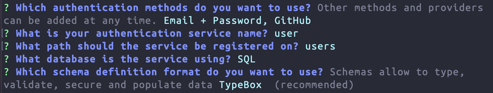
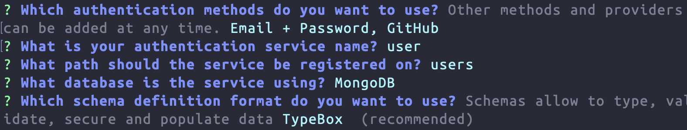

# Authentication

Authentication is an important aspect of any web application that involves user accounts. It allows users to log in and prove their identity, which is critical for keeping the application secure and ensuring that only authorized users can access sensitive information or perform certain actions.

The Feathers CLI allows to easily add authentication to our application, including features such as creating and verifying tokens, storing and retrieving user credentials securely, and implementing OAuth-based authentication with third-party providers. The following authentication strategies are included:

- __JWT__ for authenticating a request with a [JSON Web Token](https://jwt.io/). It is an access token that is issued by the Feathers server for a limited time (one day by default). When someone logs in, Feathers issues a JWT that they need to include with every request they make to the application.
- __Local Authentication__ allows someone to log in and create a JWT using a username (usually an email address) and password that they have already registered with our application. The CLI will also help you set up a database to store this information securely.
- __OAuth Authentication__ allows someone to log in using their account from a third-party provider like Google, GitHub, or Twitter. The Feathers CLI can set this up too.

## Generating authentication

To initialize a standard authentication setup we can run

```
npx feathers generate authentication
```

For the first prompt, let's select GitHub in addition to _Email + Password_ by navigating to it with the arrow down key and then pressing space. All other questions can be answered with the default by pressing enter:

<DatabaseBlock global-id="sql">



</DatabaseBlock>

<DatabaseBlock global-id="mongodb">



</DatabaseBlock>


## What's next?

By running this command we set up a `users` endpoint to register and store users and an `authentication` endpoint to log them in. It also generated everything necessary for a log in via GitHub. 

If you're not familiar with how the authentication process works, don't worry. We'll cover that in the [Logging In](./login.md) chapter of this guide but first let's look at Feathers [core concepts of services](./services.md) that our new `users` endpoint already uses.
