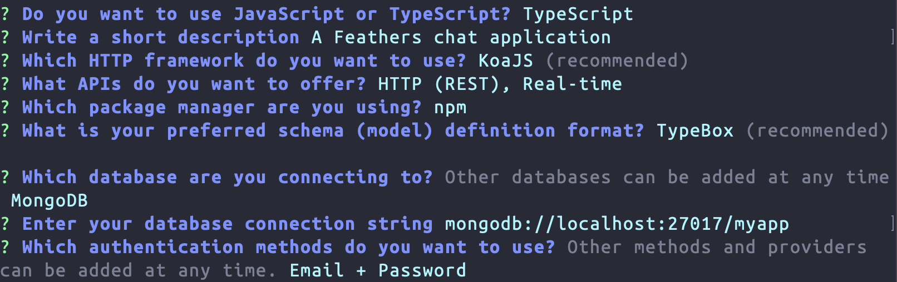

# Creating an app

In the [quick start](./starting.md) we created a Feathers application in a single file to get a better understanding of how Feathers itself works.


The Feathers CLI allows us to initialize a new Feathers server with a recommended structure and generate things we commonly need like authentication, a database connection or new services.

## Generating the application

You can create a new Feathers application by running `npm create feathers <name>`. To create a new Feathers application called `feathers-chat` we can run:

```sh
npm create feathers@pre feathers-chat
```

If you never ran the command before you might be ask to confirm the package installation by pressing enter.

<BlockQuote type="warning">

Since the generated application is using modern features like ES modules, the Feathers CLI requires Node 16 or newer. The `feathers --version` command should show `5.0.0-pre.31` or later.

</BlockQuote>

First, choose if you want to use JavaScript or TypeScript. When presented with the project name, just hit enter, or enter a name (no spaces). Next, write a short description for your application. Confirm the next questions with the default selection by pressing Enter. When asked about authentication methods, let's include GitHub as well so we can look at adding a "Log In with Github" button.

<DatabaseBlock global-id="sql">

<BlockQuote type="tip">

If you want to use **MongoDB** instead of SQLite (or another SQL database) for this quide, select it in the **Database** dropdown in the main menu.

</BlockQuote>

</DatabaseBlock>

Once you confirm the last prompt, the final selection should look similar to this:

<DatabaseBlock global-id="sql">


<BlockQuote type="info" label="Note">

`SQLite` creates an SQL database in a file so we don't need to have a database server running. For any other selection, the database you choose has to be available at the connection string.

</BlockQuote>

</DatabaseBlock>

<DatabaseBlock global-id="mongodb">



</DatabaseBlock>

Sweet! We generated our first Feathers application in a new folder called `feathers-chat` so we need to go there.

```sh
cd feathers-chat
```

## Running the server and tests

The server can be started by running

<LanguageBlock global-id="ts">

```sh
npm run compile
npm start
```

</LanguageBlock>

<LanguageBlock global-id="js">

```sh
npm start
```

</LanguageBlock>

After that, you will see the Feathers logo at

```
http://localhost:3030
```

<BlockQuote type="warning" label="Note">

You can exit the running process by pressing **CTRL + C**

</BlockQuote>

The app also comes with a set of basic tests which can be run with

```sh
npm test
```

There is also a handy development command that restarts the server automatically whenever we make a code change:

```sh
npm run dev
```

<BlockQuote type="warning" label="Note">

Keep this command running throughout the rest of this guide so it will reload all our changes automatically.

</BlockQuote>

## What's next?

In this chapter we we created a new Feathers application. To learn more about the generated files and what you can do with the CLI, have a look at the CLI guide after finishing the Getting Started guide. In [the next chapter](./services.md) we will learn more about Feathers services and databases.
