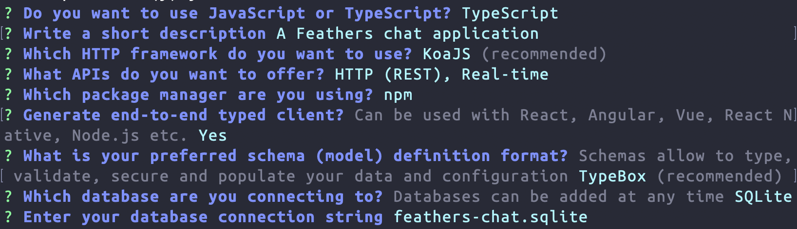

# Generating an app

In the [getting started chapter](./starting.md) we created a Feathers application in a single file to get a better understanding how Feathers itself works. The Feathers CLI allows us to initialize a new Feathers server with a recommended structure and helps with generating things we commonly need like authentication, a database connection, new services or hooks (more about hooks in a little bit). It can be installed via:

```sh
npm install @feathersjs/cli -g
```

> __Important:__ As mentioned when [getting ready](./starting.md),  `@feathersjs/cli` also requires Node version 10 or later. If you already have it installed, `feathers --version` should show `4.1.0` or later.

## Generating the application

Let's create a new directory for our app and in it, generate a new application:

```sh
mkdir feathers-chat
cd feathers-chat/
feathers generate app
```

First, choose if you want to use JavaScript or TypeScript. When presented with the project name, just hit enter, or enter a name (no spaces). Next, write a short description of your application. All other questions should be confirmed with the default selection by hitting Enter.

Once you confirm the last prompt, the final selection should look like this:



> __Important:__ If you are following this guide for the first time we recommend to not change any of those settings other than the TypeScript/JavaScript selection. Otherwise you might run into things that are not covered here.

## The generated files

Let's have a brief look at the files that have been generated:

:::: tabs :options="{ useUrlFragment: false }"
::: tab "JavaScript"
* `config/` contains the configuration files for the app
  * `default.json` contains the basic application configuration
  * `production.json` files override `default.json` when in production mode by setting `NODE_ENV=production`. For details, see the [configuration API documentation](../../api/configuration.md)
* `node_modules/` our installed dependencies which are also added in the `package.json`
* `public/` contains static files to be served. A sample favicon and `index.html` (which will show up when going directly to the server URL) are already included.
* `src/` contains the Feathers server code.
  * `hooks/` contains our custom [hooks](../basics/hooks.md)
  * `services/` contains our [services](../basics/services.md)
    * `users/` is a service that has been generated automatically to allow registering and authenticating users
      * `users.class.js` is the service class
      * `users.hooks.js` initializes Feathers hooks for this service
      * `users.service.js` registers this service on our Feathers application
  * `middleware/` contains any [Express middleware](http://expressjs.com/en/guide/writing-middleware.html)
  * `models/` contains database model files
    * `users.model.js` sets up our user collection for NeDB
  * `app.js` configures our Feathers application like we did in the [getting started chapter](../basics/starting.md)
  * `app.hooks.js` registers hooks that apply to every service
  * `authentication.js` sets up Feathers authentication system
  * `channels.js` sets up Feathers [event channels](../../api/channels.md)
  * `index.js` loads and starts the application
* `test/` contains test files for the app, hooks and services
  * `services/` has our service tests
    * `users.test.js` contains some basic tests for the `users` service
  * `app.test.js` tests that the index page appears, as well as 404 errors for HTML pages and JSON
  * `authentication.test.js` includes some tests that basic authentication works
* `.editorconfig` is an [EditorConfig](http://editorconfig.org/) setting to help developers define and maintain consistent coding styles among different editors and IDEs.
* `.eslintrc.json` contains defaults for linting your code with [ESLint](http://eslint.org/docs/user-guide/getting-started).
* `.gitignore` specifies [intentionally untracked files](https://git-scm.com/docs/gitignore) which [git](https://git-scm.com/), [GitHub](https://github.com/) and other similar projects ignore.
* `package.json` contains [information](https://docs.npmjs.com/files/package.json) about our NodeJS project like its name or dependencies.
* `README.md` has installation and usage instructions
:::
::: tab "TypeScript"
* `config/` contains the configuration files for the app
  * `default.json` contains the basic application configuration
  * `production.json` files override `default.json` when in production mode by setting `NODE_ENV=production`. For details, see the [configuration API documentation](../../api/configuration.md)
* `node_modules/` our installed dependencies which are also added in the `package.json`
* `public/` contains static files to be served. A sample favicon and `index.html` (which will show up when going directly to the server URL) are already included.
* `src/` contains the Feathers server code.
  * `hooks/` contains our custom [hooks](../basics/hooks.md)
  * `services/` contains our [services](../basics/services.md)
    * `users/` is a service that has been generated automatically to allow registering and authenticating users
      * `users.class.ts` is the service class
      * `users.hooks.ts` initializes Feathers hooks for this service
      * `users.service.ts` registers this service on our Feathers application
  * `middleware/` contains any [Express middleware](http://expressjs.com/en/guide/writing-middleware.html)
  * `models/` contains database model files
    * `users.model.ts` sets up our user collection for NeDB
  * `app.ts` configures our Feathers application like we did in the [getting started chapter](../basics/starting.md)
  * `app.hooks.ts` registers hooks that apply to every service
  * `authentication.ts` sets up Feathers authentication system
  * `channels.ts` sets up Feathers [event channels](../../api/channels.md)
  * `declarations.ts` contains TypeScript declarations for our app
  * `index.ts` loads and starts the application
* `test/` contains test files for the app, hooks and services
  * `services/` has our service tests
    * `users.test.ts` contains some basic tests for the `users` service
  * `app.test.ts` tests that the index page appears, as well as 404 errors for HTML pages and JSON
  * `authentication.test.ts` includes some tests that basic authentication works
* `.editorconfig` is an [EditorConfig](http://editorconfig.org/) setting to help developers define and maintain consistent coding styles among different editors and IDEs.
* `.gitignore` specifies [intentionally untracked files](https://git-scm.com/docs/gitignore) which [git](https://git-scm.com/), [GitHub](https://github.com/) and other similar projects ignore.
* `tsconfig.json` the TypeScript [compiler configuration](https://www.typescriptlang.org/docs/handbook/tsconfig-json.html)
* `package.json` contains [information](https://docs.npmjs.com/files/package.json) about our NodeJS project like its name or dependencies.
* `README.md` has installation and usage instructions
:::
::::

## Configure functions

The most important pattern used in the generated application to split things up into individual files are _configure functions_ which are functions that are exported from a file and take the Feathers [app object](../../api/application.md) and then use it to e.g. register services. Those functions are then passed to [app.configure](../../api/application.md#configurecallback).

For example, have a look at the following files:

:::: tabs :options="{ useUrlFragment: false }"
::: tab "JavaScript"
`src/services/index.js` looks like this:

```js
const users = require('./users/users.service.js');
// eslint-disable-next-line no-unused-vars
module.exports = function (app) {
  app.configure(users);
};
```

It uses another configure function exported from `src/services/users/users.service.js`. The export from `src/services/index.js` is in turn used in `src/app.js` as:

```js
// ...
const services = require('./services');

// ...
app.configure(authentication);
// Set up our services (see `services/index.js`)
app.configure(services);
// ...
```
:::
::: tab "TypeScript"
`src/services/index.ts` looks like this:

```ts
import { Application } from '../declarations';
import users from './users/users.service';
// Don't remove this comment. It's needed to format import lines nicely.

export default function (app: Application) {
  app.configure(users);
}
```

It uses another configure function exported from `src/services/users/users.service.ts`. The export from `src/services/index.js` is in turn used in `src/app.ts` as:

```ts
// ...
import services from './services';

// ...
app.configure(authentication);
// Set up our services (see `services/index.js`)
app.configure(services);
// ...
```
:::
::::

This is how the generator splits things up into separate files and any documentation example that uses the `app` object can be used in a configure function. You can create your own files that export a configure function and `require`/`import` and `app.configure` them in `app.js`.

> __Note:__ Keep in mind that the order in which configure functions are called might matter, e.g. if it is using a service, that service has to be registered first.

## Running the server and tests

The server can now be started by running

```sh
npm start
```

After that, you can see a welcome page at [localhost:3030](http://localhost:3030). 

The app also comes with a set of basic tests which can be run with

```sh
npm test
```

There is also a handy development command that restarts the server automatically whenever we make a code change:

```sh
npm run dev
```

You can keep this command running throughout the rest of this guide, it will reload all our changes automatically.

## What's next?

In this chapter we installed the Feathers CLI, scaffolded a new Feathers application and learned how it splits things up into separate files. In [the next chapter](./services.md) we will learn more about Feathers services and databases.
