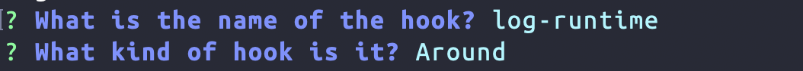

# Hooks

When we created our messages service in [the services chapter](./services.md), we saw that Feathers services are a great way to implement data storage and modification. Technically, we could write our entire app with services but very often we need similar functionality across multiple services. For example, we might want to check for all services if a user is allowed to access it. With just services, we would have to write this every time.

This is where Feathers hooks come in. Hooks are pluggable middleware functions that can be registered **around**, **before**, **after** or on **errors** of a service method without changing the original code.

Just like services themselves, hooks are _transport independent_. They are usually also service independent, meaning they can be used with ​*any*​ service. This pattern keeps your application logic flexible, composable, and much easier to trace through and debug.
Hooks are commonly used to handle things like validation, authorization, logging, sending emails and more.

<BlockQuote type="tip">

A full overview of the hook API can be found in the [hooks API documentation](../../api/hooks.md). For the general design pattern behind hooks see [this blog post](https://blog.feathersjs.com/design-patterns-for-modern-web-apis-1f046635215).

</BlockQuote>

## Generating a hook

Let's generate a hook that logs the total runtime of a service method to the console.

```sh
npx feathers generate hook
```

We call our hook `log-runtime` and confirm the type with enter to make it an `around` hook.



<LanguageBlock global-id="ts">

Now update `src/hooks/log-runtime.ts` as follows:

</LanguageBlock>
<LanguageBlock global-id="js">

Now update `src/hooks/log-runtime.js` as follows:

</LanguageBlock>

```ts{2,5-10}
import type { HookContext, NextFunction } from '../declarations'
import { logger } from '../logger'

export const logRuntime = async (context: HookContext, next: NextFunction) => {
  const startTime = Date.now()
  // Run everything else (other hooks and service call)
  await next()

  const duration = Date.now() - startTime
  logger.info(`Calling ${context.method} on ${context.path} took ${duration}ms`)
}

```

In this hook, we store the start time and then run all other hooks and the service method by calling `await next()`. After that we can calculate the duration in milliseconds by subtracting the start time from the current time and log the information using the application [logger](../cli/logger.md).

## Hook functions

A hook function is an `async` function that takes the [hook `context`](#hook-context) and a `next` function as the parameter. If the hook should only run on **error**, **before** or **after** the service method, it does not need a `next` function. However since we need to do both, get the start time before and the end time after, we created an `around` hook.

Hooks run in the order they are registered and if a hook function throws an error, all remaining hooks (and the service call if it didn't run yet) will be skipped and the error will be returned.

## Hook context

The hook `context` is an object which contains information about the service method call. It has read-only and writable properties.

Read-only properties are:

- `context.app` - The Feathers application object. This commonly used to call other services
- `context.service` - The service object this hook is currently running on
- `context.path` - The path (name) of the service
- `context.method` - The name of the service method being called
- `context.type` - The hook type (around, before, etc)

Writeable properties are:

- `context.params` - The service method call `params`. For external calls, `params` usually contains:
  - `context.params.query` - The query filter (e.g. from the REST query string) for the service call
  - `context.params.provider` - The name of the transport the call has been made through. Usually `"rest"` or `"socketio"`. Will be `undefined` for internal calls.
  - `context.params.user` - _If authenticated_, the data of the user making the service method call.
- `context.id` - The `id` of the record if the service method call is a `get`, `remove`, `update` or `patch`
- `context.data` - The `data` sent by the user in a `create`, `update` and `patch` and custom service method call
- `context.error` - The error that was thrown (in `error` hooks)
- `context.result` - The result of the service method call (available after calling `await next()` or in `after` hooks)

<BlockQuote type="tip">

For more information about the hook context see the [hooks API documentation](../../api/hooks.md).

</BlockQuote>

## Registering hooks

In a Feathers application, hooks are being registered in the [&lt;servicename&gt;](../cli/service.md) file. The hook registration object is an object with `{ around, before, after, error }` and a list of hooks per method like `{ all: [], find: [], create: [] }`.

<LanguageBlock global-id="ts">

To log the runtime of our `messages` service calls we can update `src/services/messages/messages.ts` like this:

</LanguageBlock>
<LanguageBlock global-id="js">

To log the runtime of all `messages` service calls we can update `src/services/messages/messages.js` like this:

</LanguageBlock>

```ts{20,38}
// For more information about this file see https://dove.feathersjs.com/guides/cli/service.html
import { authenticate } from '@feathersjs/authentication'

import { hooks as schemaHooks } from '@feathersjs/schema'

import {
  messageDataValidator,
  messagePatchValidator,
  messageQueryValidator,
  messageResolver,
  messageExternalResolver,
  messageDataResolver,
  messagePatchResolver,
  messageQueryResolver
} from './messages.schema'

import type { Application } from '../../declarations'
import { MessageService, getOptions } from './messages.class'
import { messagePath, messageMethods } from './messages.shared'
import { logRuntime } from '../../hooks/log-runtime'

export * from './messages.class'
export * from './messages.schema'

// A configure function that registers the service and its hooks via `app.configure`
export const message = (app: Application) => {
  // Register our service on the Feathers application
  app.use(messagePath, new MessageService(getOptions(app)), {
    // A list of all methods this service exposes externally
    methods: messageMethods,
    // You can add additional custom events to be sent to clients here
    events: []
  })
  // Initialize hooks
  app.service(messagePath).hooks({
    around: {
      all: [
        logRuntime,
        authenticate('jwt'),
        schemaHooks.resolveExternal(messageExternalResolver),
        schemaHooks.resolveResult(messageResolver)
      ]
    },
    before: {
      all: [schemaHooks.validateQuery(messageQueryValidator), schemaHooks.resolveQuery(messageQueryResolver)],
      find: [],
      get: [],
      create: [schemaHooks.validateData(messageDataValidator), schemaHooks.resolveData(messageDataResolver)],
      patch: [schemaHooks.validateData(messagePatchValidator), schemaHooks.resolveData(messagePatchResolver)],
      remove: []
    },
    after: {
      all: []
    },
    error: {
      all: []
    }
  })
}

// Add this service to the service type index
declare module '../../declarations' {
  interface ServiceTypes {
    [messagePath]: MessageService
  }
}
```

Now every time our messages service is accessed successfully, the name, method and runtime will be logged.

<BlockQuote type="tip">

`all` is a special keyword which means those hooks will run before the method specific hooks. Method specific hooks can be registered based on their name, e.g. to only log the runtime for `find` and `get`:

```ts
app.service('messages').hooks({
  around: {
    all: [authenticate('jwt')],
    find: [logRuntime],
    get: [logRuntime]
  }
  // ...
})
```

</BlockQuote>

## What's next?

In this chapter we learned how Feathers hooks can be used as middleware for service method calls without having to change our service. Here we just logged the runtime of a service method to the console but you can imagine that hooks can be useful for many other things like more advanced logging, sending notifications or checking user permissions.

You may also have noticed above that there are already some hooks like `schemaHooks.validateQuery` or `schemaHooks.resolveResult` registered on our service. This brings us to the next chapter on how to define our data model with [schemas and resolvers](./schemas.md).
