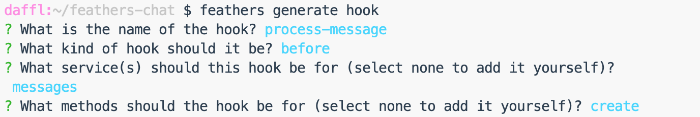
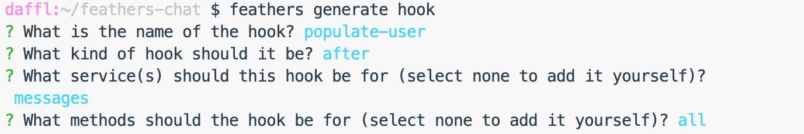

# Hooks

As we have seen in the [services chapter](./services.md), Feathers services are a great way to implement data storage and modification. Technically, we could implement our entire app with services but very often we need similar functionality across multiple services. For example, we might want to check for all services if a user is allowed to even use it or add the current date to all data that we are saving. With just using services we would have to implement this again every time.

This is where Feathers hooks come in. Hooks are pluggable middleware functions that can be registered __before__, __after__ or on __errors__ of a service method. You can register a single hook function or create a chain of them to create complex work-flows. In this chapter we will learn more about hooks and create workflows to process new chat messages. 

Just like services themselves, hooks are *transport independent*. They are usually also service agnostic, meaning they can be used with ​*any*​ service. This pattern keeps your application logic flexible, composable, and much easier to trace through and debug.

> __Note:__ A full overview of the hook API can be found in the [hooks API documentation](../../api/hooks.md).

Hooks are commonly used to handle things like validation, authorization, logging, populating related entities, sending notifications and more. 

> __Pro tip:__ For the general design pattern behind hooks see [this blog post](https://blog.feathersjs.com/design-patterns-for-modern-web-apis-1f046635215). A more Feathers specific overview can be found [here](https://blog.feathersjs.com/api-service-composition-with-hooks-47af13aa6c01).

## Quick example

Here is a quick example for a hook that adds a `createdAt` property to the data before calling the actual `create` service method:

:::: tabs :options="{ useUrlFragment: false }"
::: tab "JavaScript"
```js
const createdAt = async context => {
  context.data.createdAt = new Date();
  
  return context;
};

app.service('messages').hooks({
  before: {
    create: [ createdAt ]
  }
});
```
:::
::: tab "TypeScript"
```ts
import { HookContext } from '@feathersjs/feathers';

const createdAt = async (context: HookContext) => {
  context.data.createdAt = new Date();
  
  return context;
};

app.service('messages').hooks({
  before: {
    create: [ createdAt ]
  }
});
```
:::
::::

## Hook functions

A hook function is a function that takes the [hook context](#hook-context) as the parameter and returns that context or nothing. Hook functions run in the order they are registered and will only continue to the next once the current hook function completes. If a hook function throws an error, all remaining hooks (and the service call if it didn't run yet) will be skipped and the error will be returned.

A common pattern the generator uses to make hooks more re-usable (e.g. making the `createdAt` property name from the example above configurable) is to create a wrapper function that takes those options and returns a hook function:

:::: tabs :options="{ useUrlFragment: false }"
::: tab "JavaScript"
```js
const setTimestamp = name => {
  return async context => {
    context.data[name] = new Date();

    return context;
  }
} 

app.service('messages').hooks({
  before: {
    create: [ setTimestamp('createdAt') ],
    update: [ setTimestamp('updatedAt') ]
  }
});
```
:::
::: tab "TypeScript"
```ts
import { HookContext } from '@feathersjs/feathers';

const setTimestamp = (name: string) => {
  return async (context: HookContext) => {
    context.data[name] = new Date();

    return context;
  }
} 

app.service('messages').hooks({
  before: {
    create: [ setTimestamp('createdAt') ],
    update: [ setTimestamp('updatedAt') ]
  }
});
```
:::
::::

Now we have a re-usable hook that can set the timestamp on any property.

## Hook context

The hook `context` is an object which contains information about the service method call. It has read-only and writable properties.

Read-only properties are:

- `context.app` - The Feathers application object. This can be used to e.g. call other services
- `context.service` - The service this hook is currently running on
- `context.path` - The path (name) of the service
- `context.method` - The service method name
- `context.type` - The hook type (`before`, `after` or `error`)

Writeable properties are:

- `context.params` - The service method call `params`. For external calls, `params` usually contains:
  - `context.params.query` - The query (e.g. query string for REST) for the service call
  - `context.params.provider` - The name of the transport (which we will look at in the next chapter) the call has been made through. Usually `rest` or `socketio`. Will be `undefined` for internal calls.
- `context.id` - The `id` for a `get`, `remove`, `update` and `patch` service method call
- `context.data` - The `data` sent by the user in a `create`, `update` and `patch` service method call
- `context.error` - The error that was thrown (in `error` hooks)
- `context.result` - The result of the service method call (in `after` hooks)

> __Note:__ For more information about the hook context see the [hooks API documentation](../../api/hooks.md).

## Registering hooks

In a Feathers application generated by the CLI, hooks are being registered in a `.hooks` file in an object in the following format:

:::: tabs :options="{ useUrlFragment: false }"
::: tab "JavaScript"
```js
module.exports = {
  before: {
    all: [],
    find: [],
    get: [],
    create: [],
    update: [],
    patch: [],
    remove: []
  },

  after: {
    all: [],
    find: [],
    get: [],
    create: [],
    update: [],
    patch: [],
    remove: []
  },

  error: {
    all: [],
    find: [],
    get: [],
    create: [],
    update: [],
    patch: [],
    remove: []
  }
};
```
:::
::: tab "TypeScript"
```ts
export default {
  before: {
    all: [],
    find: [],
    get: [],
    create: [],
    update: [],
    patch: [],
    remove: []
  },

  after: {
    all: [],
    find: [],
    get: [],
    create: [],
    update: [],
    patch: [],
    remove: []
  },

  error: {
    all: [],
    find: [],
    get: [],
    create: [],
    update: [],
    patch: [],
    remove: []
  }
};
```
:::
::::

This makes it easy to see at one glance in which order hooks are executed and for which method.

> __Note:__ `all` is a special keyword which means those hooks will run before the method specific hooks in this chain.

## Processing messages

Cool. Now that we learned about hooks we can add two hooks to our messages service that help sanitize new messages and add information about the user that sent it.

### Sanitize new message

When creating a new message, we automatically sanitize our input, add the user that sent it and include the date the message has been created before saving it in the database. In this specific case it is a *before* hook. To create a new hook we can run:

```sh
feathers generate hook
```

Let's call this hook `process-message`. We want to pre-process client-provided data. Therefore, in the next prompt asking for what kind of hook, choose `before` and press Enter.

Next a list of all our services is displayed. For this hook, only choose the `messages` service. Navigate to the entry with the arrow keys and select it with the space key, then confirm with enter.

A hook can run before any number of [service methods](./services.md). For this specific hook, only select `create`. After confirming the last prompt you should see something like this:



A hook was generated and wired up to the selected service. Now it's time to add some code. 

:::: tabs :options="{ useUrlFragment: false }"
::: tab "JavaScript"
Update `src/hooks/process-message.js` to look like this:

```js
module.exports = function (options = {}) { // eslint-disable-line no-unused-vars
  return async context => {
    const { data } = context;

    // Throw an error if we didn't get a text
    if(!data.text) {
      throw new Error('A message must have a text');
    }

    // The logged in user
    const { user } = context.params;
    // The actual message text
    // Make sure that messages are no longer than 400 characters
    const text = data.text.substring(0, 400);

    // Update the original data (so that people can't submit additional stuff)
    context.data = {
      text,
      // Set the user id
      userId: user._id,
      // Add the current date
      createdAt: new Date().getTime()
    };

    return context;
  };
};
```
:::
::: tab "TypeScript"
Update `src/hooks/process-message.ts` to look like this:

```js
// Use this hook to manipulate incoming or outgoing data.
// For more information on hooks see: http://docs.feathersjs.com/api/hooks.html
import { Hook, HookContext } from '@feathersjs/feathers';

export default () : Hook => {
  return async (context: HookContext) => {
    const { data } = context;

    // Throw an error if we didn't get a text
    if(!data.text) {
      throw new Error('A message must have a text');
    }

    // The authenticated user
    const user = context.params.user;
    // The actual message text
    const text = data.text
      // Messages can't be longer than 400 characters
      .substring(0, 400);

    // Override the original data (so that people can't submit additional stuff)
    context.data = {
      text,
      // Set the user id
      userId: user!._id,
      // Add the current date
      createdAt: new Date().getTime()
    };

    // Best practice: hooks should always return the context
    return context;
  };
}
```
:::
::::

This validation code includes:

1. A check if there is a `text` in the data and throws an error if not
2. Truncate the message's `text` property to 400 characters
3. Update the data submitted to the database to contain:
    - The new truncated text
    - The currently authenticated user id (so we always know who sent it)
    - The current (creation) date

### Populate the message sender

In the `process-message` hook we are currently just adding the user's `_id` as the `userId` property in the message. We want to show more information about the user that sent it in the UI, so we'll need to populate more data in the message response.

We can do this by creating another hook called `populate-user` which is an `after` hook on the `messages` service for `all` methods:

```sh
feathers generate hook
```



:::: tabs :options="{ useUrlFragment: false }"
::: tab "JavaScript"
Update `src/hooks/populate-user.js` to:

```js
/* eslint-disable require-atomic-updates */
module.exports = function (options = {}) { // eslint-disable-line no-unused-vars
  return async context => {
    // Get `app`, `method`, `params` and `result` from the hook context
    const { app, method, result, params } = context;
    // Function that adds the user to a single message object
    const addUser = async message => {
      // Get the user based on their id, pass the `params` along so
      // that we get a safe version of the user data
      const user = await app.service('users').get(message.userId, params);

      // Merge the message content to include the `user` object
      return {
        ...message,
        user
      };
    };

    // In a find method we need to process the entire page
    if (method === 'find') {
      // Map all data to include the `user` information
      context.result.data = await Promise.all(result.data.map(addUser));
    } else {
      // Otherwise just update the single result
      context.result = await addUser(result);
    }

    return context;
  };
};
```
:::

::: tab "TypeScript"
Update `src/hooks/populate-user.ts` to:

```ts
// Use this hook to manipulate incoming or outgoing data.
// For more information on hooks see: http://docs.feathersjs.com/api/hooks.html
import { Hook, HookContext } from '@feathersjs/feathers';

export default (): Hook => {
  return async (context: HookContext) => {
    // Get `app`, `method`, `params` and `result` from the hook context
    const { app, method, result, params } = context;
    // Function that adds the user to a single message object
    const addUser = async (message: any) => {
      // Get the user based on their id, pass the `params` along so
      // that we get a safe version of the user data
      const user = await app.service('users').get(message.userId, params);

      // Merge the message content to include the `user` object
      return {
        ...message,
        user
      };
    };

    // In a find method we need to process the entire page
    if (method === 'find') {
      // Map all data to include the `user` information
      context.result.data = await Promise.all(result.data.map(addUser));
    } else {
      // Otherwise just update the single result
      context.result = await addUser(result);
    }

    return context;
  };
}
```
:::

::::

> __Note:__ `Promise.all` makes sure that all asynchronous operations complete before returning all the data.

> __Pro tip:__ This is one way to associate data in Feathers. For more information about associations see [this FAQ](../../help/faq.md#how-do-i-do-associations).

## Hooks vs. extending services

In the [previous chapter](./services.md) we extended our user service to add a user avatar. This could also be put in a hook instead but made a good example to illustrate how to extend an existing service. There are no explicit rules when to use a hook or when to extend a service but here are some guidelines.

Use a hook when

- The functionality can be used in more than one place (e.g. validation, permissions etc.)
- It is not a core responsibility of the service and the service can work without it (e.g. sending an email after a user has been created)

Extend a service when

- The functionality is only needed in this one place
- The service could not function without it

Create your own (custom) service when

- Multiple services are combined together (e.g. reports)
- The service does something other than talk to a database (e.g. another API, sensors etc.)

## What's next?

In this chapter we learned how Feathers hooks can be used as middleware for service method calls to validate and manipulate incoming and outgoing data without having to change our service. We now have a fully working chat application. Before we [create a frontend for it](./frontend.md) though, let's first look at how [authentication works with Feathers](./authentication.md).
