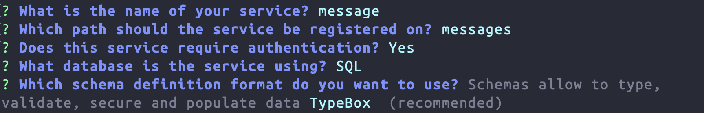

# Services

Services are the heart of every Feathers application. You probably remember the service we made in the [quick start](./starting.md) to create and find messages. In this chapter we will dive more into services and create a database backed service for our chat messages.

## Feathers services

In Feathers, a service is an object or instance of a class that implements certain methods. Services provide a way for Feathers to interact with different kinds of data sources in a uniform, protocol-independent way.

For example, you could use services to read and/or write data to one of the supported databases, interact with the file system, call a third-party API/service (such as MailGun for sending emails, Stripe for processing payments, or OpenWeatherMap for returning weather information), or even read and/or write to a completely different type of database.

A standardized interface allows us to interact with the Database/API/Gnomes inside in a uniform manner across any transport protocol, be it REST, websockets, internally within the application, or Carrier Pigeon 🕊️

Once you write a service method, which usually does not do anything Feathers-specific, you can automatically use it as a REST endpoint or call it through a websocket. Feathers takes care of all the necessary boilerplate, so you can focus on writing the service method itself.

### Service methods

Service methods are [CRUD](https://en.wikipedia.org/wiki/Create,_read,_update_and_delete) methods that a service can implement. Feathers offers a set of general methods that a service can implement, these are:

- `find` - Find all data (potentially matching a query)
- `get` - Get a single data entry by its unique identifier
- `create` - Create new data
- `update` - Update an existing data entry by completely replacing it
- `patch` - Update one or more data entries by merging with the new data
- `remove` - Remove one or more existing data entries
- `setup` - Called when the application is started
- `teardown` - Called when the application is shut down

Below is an example of Feathers service interface as a class and basic registration on a Feathers application via [app.use(name, service[, options])](../../api/application.md#use-path-service):

```ts
import { feathers } from '@feathersjs/feathers'
import type { Application, Id, NullableId, Params } from '@feathersjs/feathers'

class MyService {
  async find(params: Params) {}
  async get(id: Id, params: Params) {}
  async create(data: any, params: Params) {}
  async update(id: NullableId, data: any, params: Params) {}
  async patch(id: NullableId, data: any, params: Params) {}
  async remove(id: NullableId, params: Params) {}
  async setup(path: string, app: Application) {}
  async teardown(path: string, app: Application) {}
}

const app = feathers<{ myservice: MyService }>()

app.use('myservice', new MyService())
```

The parameters for service methods are:

- `id` - The unique identifier for the data
- `data` - The data sent by the user (for `create`, `update`, `patch` and custom methods)
- `params` - Additional parameters, for example the authenticated user or the query

For `setup` and `teardown` (which are only called once on application startup and shutdown) we have

- `path` - The path the service is registered on
- `app` - The [Feathers application](./../../api/application.md)

Usually those methods can be used for most API functionality but it is also possible to add your own [custom service methods](../../api/services.md#custom-methods).

<BlockQuote type="info">

A service does not have to implement all those methods but must have at least one. For more information about services, service methods, and parameters see the [Service API documentation](../../api/services.md).

</BlockQuote>

When used as a REST API, incoming requests get mapped automatically to their corresponding service method like this:

| Service method                              | HTTP method | Path                  |
| ------------------------------------------- | ----------- | --------------------- |
| `service.find({ query: {} })`               | GET         | /messages             |
| `service.find({ query: { unread: true } })` | GET         | /messages?unread=true |
| `service.get(123)`                          | GET         | /messages/123         |
| `service.create(body)`                      | POST        | /messages             |
| `service.update(123, body)`                 | PUT         | /messages/123         |
| `service.patch(123, body)`                  | PATCH       | /messages/123         |
| `service.remove(123)`                       | DELETE      | /messages/123         |

### Service events

A registered service will automatically become a [NodeJS EventEmitter](https://nodejs.org/api/events.html) that sends events with the new data when a service method that modifies data (`create`, `update`, `patch` and `remove`) returns. Events can be listened to with `app.service('messages').on('eventName', data => {})`. Here is a list of the service methods and their corresponding events:

| Service method     | Service event           |
| ------------------ | ----------------------- |
| `service.create()` | `service.on('created')` |
| `service.update()` | `service.on('updated')` |
| `service.patch()`  | `service.on('patched')` |
| `service.remove()` | `service.on('removed')` |

This is how Feathers does real-time.

```js
app.service('myservice').on('created', (data) => {
  console.log('Got created event', data)
})
```

## Database adapters

Now that we have all those service methods, we could go ahead and implement any kind of custom logic using any backend, similar to what we did in the [quick start guide](./starting.md). Very often, this means creating, reading, updating and removing data from a database.

Writing all that code yourself for every service is pretty repetitive and cumbersome, which is why Feathers has a collection of pre-built services for different databases. They offer most of the basic functionality and can always be customized to your needs. Feathers database adapters support a common [usage API](../../api/databases/common.md), pagination and [querying syntax](../../api/databases/querying.md) for many popular databases. The following database adapters are maintained as part of Feathers core:

- [SQL](../../api/databases/knex.md) for databases like PostgreSQL, SQLite, MySQL, MariaDB, MSSQL
- [MongoDB](../../api/databases/mongodb.md) for MongoDB
- [Memory](../../api/databases/memory.md) for in-memory data

<BlockQuote type="tip">

There are also many other community maintained database integrations which you can explore on the [ecosystem page](/ecosystem/?cat=Database&sort=downloads). Since they are not part of Feathers core, they are outside the scope of these guides.

</BlockQuote>

If you went with the default selection, we will use **SQLite** which writes the database to a file and does not require any additional setup. The user service that was created when we [generated authentication](./authentication.md) is already using it.

## Generating a service

In our new `feathers-chat` application, we can create database backed services with the following command:

```sh
npx feathers generate service
```

The name for our service is `message` (this is used for variable names etc.) and for the path we use `messages`. Anything else we can confirm with the default:

<DatabaseBlock global-id="sql">



</DatabaseBlock>

<DatabaseBlock global-id="mongodb">


</DatabaseBlock>

This is it, we now have a database backed messages service with authentication enabled.

## What's next?

In this chapter we learned about services as a Feathers core concept for abstracting data operations. We also saw how a service sends events which we will use later to create real-time applications. After that, we generated a messages service. Next, we will [look at Feathers hooks](./hooks.md) as a way to create middleware for services.
