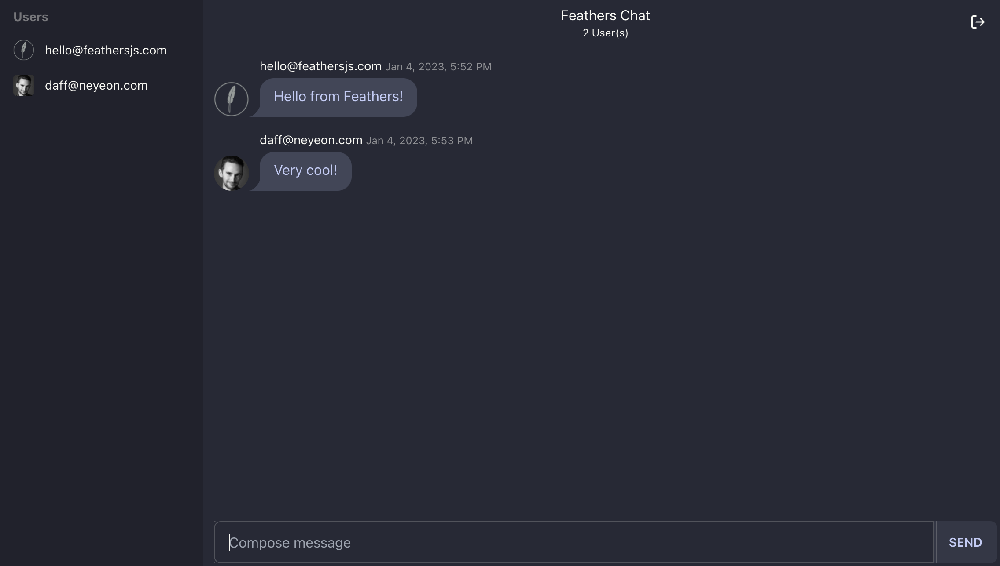

# Getting ready

Alright then! Let's learn what Feathers is all about. First we'll have a look at what we are going to do in this guide, what you should already know and what needs to be installed to use Feathers.

## What we will do

In this guide we will get a [quick start](./starting.md) by creating our first simple Feathers REST and real-time API and a website to use it from scratch. Then we will learn about the [Feathers CLI](./generator.md) and the core concepts of [services](./services.md), [hooks](./hooks.md) and [authentication](./authentication.md) by building a chat application that allows users to sign up, log in (including with GitHub) and send and receive messages in real-time. It will look like this:



You can find the final version at

<Tabs group-name="Feathers Chat">

<Tab name="TypeScript" global-id="ts" >

The [feathersjs/feathers-chat-ts](https://github.com/feathersjs/feathers-chat-ts) repository

</Tab>

<Tab name="JavaScript" global-id="js">

The [feathersjs/feathers-chat](https://github.com/feathersjs/feathers-chat) repository

</Tab>

</Tabs>

## Prerequisites

Feathers works with NodeJS 14 and later and will always support the [currently active releases](https://github.com/nodejs/Release#release-schedule). We recommend using the latest available version from the [NodeJS website](https://nodejs.org/en/). On MacOS and other Unix systems the [Node Version Manager](https://github.com/creationix/nvm) is a good way to quickly install the latest version of NodeJS and keep it up to date.

After successful installation, the `node` and `npm` commands should be available on the terminal and show something similar when running the following commands:

```
$ node --version
```

```
$ npm --version
```

> __Note:__ Running NodeJS and npm should not require admin or root privileges.

Feathers does work in the browser and supports all modern browser. The browser examples used in the guides will work with all browser versions that support `async/await`.

## What you should know

In order to get the most out of this guide you should have reasonable JavaScript experience using [ES6](http://es6-features.org/) and later as well as [async/await](https://developer.mozilla.org/en-US/docs/Web/JavaScript/Reference/Statements/async_function) and some experience with NodeJS and the JavaScript features it supports like the [module system](https://nodejs.org/api/modules.html). If you selected TypeScript as the language, you should be familiar with TypeScript (including generics). Some familiarity with HTTP and [REST APIs](https://en.wikipedia.org/wiki/Representational_state_transfer) as well as websockets is also helpful but not necessary.

Feathers works standalone but also provide an integration with [Koa](../../api/koa.md) or [Express](../../api/express.md). This guide does not require any in-depth knowledge of the web framework you chose but some experience can be helpful in the future.

## What's next?

All set up and good to go? Let's [install Feathers and create our first app](./starting.md).
