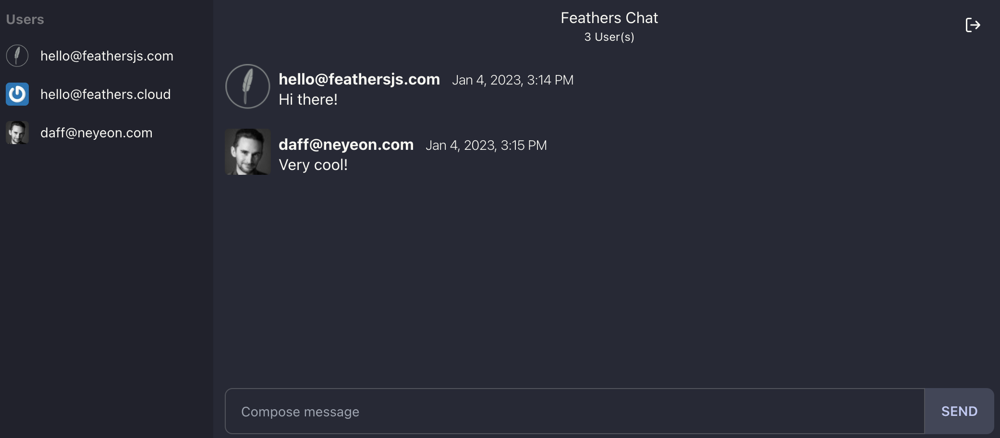

# JavaScript web app

As we have seen [in the quick start guide](../basics/starting.md), Feathers works great in the browser and comes with client services that allow it to easily connect to a Feathers server.

In this chapter we will create a real-time chat web application with signup and login using modern plain JavaScript that connects to the API server we built in the [getting started guide](../basics/generator.md). It is mobile friendly and will work in the latest versions of Chrome, Firefox, Safari and Edge. We won't be be using a transpiler like Webpack or Babel which is also why there is no TypeScript option. The final version can be found in `public/` folder of the [feathers-chat repository](https://github.com/feathersjs/feathers-chat/tree/dove/public).



<BlockQuote type="tip">

We will not be using a frontend framework so we can focus on what Feathers is all about. Feathers is framework agnostic and can be used with any frontend framework like React, VueJS or Angular. For more information see the [frameworks section](../frameworks.md).

</BlockQuote>

## Set up the page

First, let's update `public/index.html` to initialize everything we need for the chat frontend:

```html
<!DOCTYPE html>
<html lang="en">
  <head>
    <title>feathers-chat</title>
    <meta name="description" content="A Feathers chat application" />
    <meta name="viewport" content="width=device-width, initial-scale=1" />
    <link
      href="https://cdn.jsdelivr.net/npm/tailwindcss@2.2/dist/tailwind.min.css"
      rel="stylesheet"
      type="text/css"
    />
    <link href="https://cdn.jsdelivr.net/npm/daisyui@2.18.1/dist/full.css" rel="stylesheet" type="text/css" />
    <link rel="stylesheet" href="https://dove.feathersjs.com/feathers-chat.css" />
  </head>
  <body>
    <div id="app" data-theme="dracula"></div>
    <script src="https://unpkg.com/@feathersjs/client@^5.0.0-pre.34/dist/feathers.js"></script>
    <script src="/socket.io/socket.io.js"></script>
    <script type="module" src="client.js"></script>
  </body>
</html>
```

This will load our chat CSS style, add a container div `#app` and load several libraries:

- The browser version of Feathers (since we are not using a module loader like Webpack or Browserify)
- Socket.io provided by the chat API
- [daisyUI](https://daisyui.com/) for a collection of CSS components
- A `client.js` for our code to live in

Let’s create `public/client.js` where all the following code will live. Each of the following code samples should be added to the end of that file.

## Connect to the API

We’ll start with the most important thing first, the connection to our Feathers API that connects to our server using websockets and initializes the [authentication client](../basics/authentication.md):

```js
/* global io, feathers, moment */
// Establish a Socket.io connection
const socket = io()
// Initialize our Feathers client application through Socket.io
// with hooks and authentication.
const client = feathers()

client.configure(feathers.socketio(socket))
// Use localStorage to store our login token
client.configure(feathers.authentication())
```

## Base HTML

Next, we have to define some static and dynamic HTML that we can insert into the page when we want to show the login page (which also doubles as the signup page) and the actual chat interface:

```js
// Login screen
const loginTemplate = (error) => `<div class="login flex min-h-screen bg-neutral justify-center items-center">
<div class="card w-full max-w-sm bg-base-100 px-4 py-8 shadow-xl">
  <div class="px-4"><i alt="" class="h-32 w-32 block mx-auto i-logos-feathersjs invert"></i>
    <h1 class="text-5xl font-bold text-center my-5 bg-clip-text bg-gradient-to-br">
      Feathers Chat
    </h1>
  </div>
  <form class="card-body pt-2">
    ${
      error
        ? `<div class="alert alert-error justify-start">
      <i class="i-feather-alert-triangle"></i>
      <span class="flex-grow">${error.message}</span>
    </div>`
        : ''
    }
    <div class="form-control">
      <label for="email" class="label"><span class="label-text">Email</span></label>
      <input type="text" name="email" placeholder="enter email" class="input input-bordered">
    </div>
    <div class="form-control mt-0">
      <label for="password" class="label"><span class="label-text">Password</span></label>
      <input type="password" name="password" placeholder="enter password" class="input input-bordered">
    </div>
    <div class="form-control mt-6"><button id="login" type="button" class="btn">Login</button></div>
    <div class="form-control mt-6"><button id="signup" type="button" class="btn">Signup</button></div>
    <div class="form-control mt-6"><a href="/oauth/github" id="github" class="btn">Login with GitHub</a></div>
  </form>
</div>
</div>`

// Main chat view
const chatTemplate =
  () => `<div class="drawer drawer-mobile"><input id="drawer-left" type="checkbox" class="drawer-toggle">
  <div class="drawer-content flex flex-col">
    <div class="navbar w-full">
      <div class="navbar-start">
        <label for="drawer-left" class="btn btn-square btn-ghost lg:hidden drawer-button">
          <i class="i-feather-menu text-lg"></i>
        </label>
      </div>
      <div class="navbar-center flex flex-col">
        <p>Feathers Chat</p>
        <label for="drawer-right" class="text-xs cursor-pointer">
          <span class="online-count">0</span> User(s)
        </label>
      </div>
      <div class="navbar-end">
        <div class="tooltip tooltip-left" data-tip="Logout">
        <button type="button" id="logout" class="btn btn-ghost"><i class="i-feather-log-out text-lg"></i></button>
      </div>
      </div>
    </div>
    <div id="chat" class="h-full overflow-y-auto px-3"></div>
    <div class="form-control w-full py-2 px-3">
      <form class="input-group overflow-hidden" id="send-message">
        <input name="text" type="text" placeholder="Compose message" class="input input-bordered w-full">
        <button type="submit" class="btn">Send</button>
      </form>
    </div>
  </div>
  <div class="drawer-side"><label for="drawer-left" class="drawer-overlay"></label>
    <ul class="menu user-list compact p-2 overflow-y-auto w-60 bg-base-300 text-base-content">
      <li class="menu-title"><span>Users</span></li>
    </ul>
  </div>
</div>`

// Helper to safely escape HTML
const escapeHTML = (str) => str.replace(/&/g, '&amp').replace(/</g, '&lt').replace(/>/g, '&gt')

const formatDate = (timestamp) =>
  new Intl.DateTimeFormat('en-US', {
    timeStyle: 'short',
    dateStyle: 'medium'
  }).format(new Date(timestamp))

// Add a new user to the list
const addUser = (user) => {
  const userList = document.querySelector('.user-list')

  if (userList) {
    // Add the user to the list
    userList.innerHTML += `<li class="user">
      <a>
        <div class="avatar indicator">
          <div class="w-6 rounded"></div>
        </div><span>${user.email}</span>
      </a>
    </li>`

    // Update the number of users
    const userCount = document.querySelectorAll('.user-list li.user').length

    document.querySelector('.online-count').innerHTML = userCount
  }
}

// Renders a message to the page
const addMessage = (message) => {
  // The user that sent this message (added by the populate-user hook)
  const { user = {} } = message
  const chat = document.querySelector('#chat')
  // Escape HTML to prevent XSS attacks
  const text = escapeHTML(message.text)

  if (chat) {
    chat.innerHTML += `<div class="chat chat-start py-2">
      <div class="chat-image avatar">
        <div class="w-10 rounded-full">
          
        </div>
      </div>
      <div class="chat-header pb-1">
        ${user.email}
        <time class="text-xs opacity-50">${formatDate(message.createdAt)}</time>
      </div>
      <div class="chat-bubble">${text}</div>
    </div>`

    // Always scroll to the bottom of our message list
    chat.scrollTop = chat.scrollHeight - chat.clientHeight
  }
}
```

This will add the following variables and functions:

- `loginTemplate` - A function that returns static HTML for the login/signup page. We can also pass an error to render an additional error message
- `chatTemplate` - Returns the HTML for the main chat page content (once a user is logged in)
- `addUser(user)` is a function to add a new user to the user list on the left
- `addMessage(message)` is a function to add a new message to the list. It will also make sure that we always scroll to the bottom of the message list as messages get added

## Displaying pages

Next, we'll add two functions to display the login and chat page, where we'll also add a list of the 25 newest chat messages and the registered users.

```js
// Show the login page
const showLogin = () => {
  document.getElementById('app').innerHTML = loginTemplate()
}

// Shows the chat page
const showChat = async () => {
  document.getElementById('app').innerHTML = chatTemplate()

  // Find the latest 25 messages. They will come with the newest first
  const messages = await client.service('messages').find({
    query: {
      $sort: { createdAt: -1 },
      $limit: 25
    }
  })

  // We want to show the newest message last
  messages.data.reverse().forEach(addMessage)

  // Find all users
  const users = await client.service('users').find()

  // Add each user to the list
  users.data.forEach(addUser)
}
```

- `showLogin(error)` will either show the content of loginTemplate or, if the login page is already showing, add an error message. This will happen when you try to log in with invalid credentials or sign up with a user that already exists.
- `showChat()` does several things. First, we add the static chatTemplate to the page. Then we get the latest 25 messages from the messages Feathers service (this is the same as the `/messages` endpoint of our chat API) using the Feathers query syntax. Since the list will come back with the newest message first, we need to reverse the data. Then we add each message by calling our `addMessage` function so that it looks like a chat app should — with old messages getting older as you scroll up. After that we get a list of all registered users to show them in the sidebar by calling addUser.

## Login and signup

Alright. Now we can show the login page (including an error message when something goes wrong) and if we are logged in, call the `showChat` we defined above. We’ve built out the UI, now we have to add the functionality to actually allow people to sign up, log in and also log out.

```js
// Retrieve email/password object from the login/signup page
const getCredentials = () => {
  const user = {
    email: document.querySelector('[name="email"]').value,
    password: document.querySelector('[name="password"]').value
  }

  return user
}

// Log in either using the given email/password or the token from storage
const login = async (credentials) => {
  try {
    if (!credentials) {
      // Try to authenticate using an existing token
      await client.reAuthenticate()
    } else {
      // Otherwise log in with the `local` strategy using the credentials we got
      await client.authenticate({
        strategy: 'local',
        ...credentials
      })
    }

    // If successful, show the chat page
    showChat()
  } catch (error) {
    // If we got an error, show the login page
    showLogin(error)
  }
}
```

- `getCredentials()` gets us the values of the username (email) and password fields from the login/signup page to be used directly with Feathers authentication.
- `login(credentials)` will either authenticate the credentials returned by getCredentials against our Feathers API using the local authentication strategy (e.g. username and password) or, if no credentials are given, try to use the JWT stored in localStorage. This will try and get the JWT from localStorage first where it is put automatically once you log in successfully so that we don’t have to log in every time we visit the chat. Only if that doesn’t work will it show the login page. Finally, if the login was successful it will show the chat page.

## Event listeners and real-time

In the last step we will add event listeners for all buttons and functionality to send new messages and make the user and message list update in real-time.

```js
const addEventListener = (selector, event, handler) => {
  document.addEventListener(event, async (ev) => {
    if (ev.target.closest(selector)) {
      handler(ev)
    }
  })
}

// "Signup and login" button click handler
addEventListener('#signup', 'click', async () => {
  // For signup, create a new user and then log them in
  const credentials = getCredentials()

  // First create the user
  await client.service('users').create(credentials)
  // If successful log them in
  await login(credentials)
})

// "Login" button click handler
addEventListener('#login', 'click', async () => {
  const user = getCredentials()

  await login(user)
})

// "Logout" button click handler
addEventListener('#logout', 'click', async () => {
  await client.logout()

  document.getElementById('app').innerHTML = loginTemplate()
})

// "Send" message form submission handler
addEventListener('#send-message', 'submit', async (ev) => {
  // This is the message text input field
  const input = document.querySelector('[name="text"]')

  ev.preventDefault()

  // Create a new message and then clear the input field
  await client.service('messages').create({
    text: input.value
  })

  input.value = ''
})

// Listen to created events and add the new message in real-time
client.service('messages').on('created', addMessage)

// We will also see when new users get created in real-time
client.service('users').on('created', addUser)

// Call login right away so we can show the chat window
// If the user can already be authenticated
login()
```

- `addEventListener` is a helper function that lets us add listeners to elements that get added or removed dynamically
- We also added click event listeners for three buttons. `#login` will get the credentials and just log in with those. Clicking `#signup` will signup and log in at the same time. It will first create a new user on our API and then log in with that same user information. Finally, `#logout` will forget the JWT and then show the login page again.
- The `#submit` button event listener gets the message text from the input field, creates a new message on the messages service and then clears out the field.
- Next, we added two `created` event listeners. One for `messages` which calls the `addMessage` function to add the new message to the list and one for `users` which adds the user to the list via `addUser`. This is how Feathers does real-time and everything we need to do in order to get everything to update automatically.
- To kick our application off, we call `login()` which as mentioned above will either show the chat application right away (if we signed in before and the token hasn’t expired) or the login page.

## Using the chat application

That’s it. We now have a plain JavaScript real-time chat frontend with login and signup. This example demonstrates many of the basic principles of how you interact with a Feathers API. You can log in with the email (`hello@feathersjs.com`) and password (`supersecret`) from the user we registered in the [authentication chapter](../basics/authentication.md) or sign up and log in with a different email address.

If you run into an issue, remember you can find the complete working example at the [feathersjs/feathers-chat](https://github.com/feathersjs/feathers-chat) repository.
