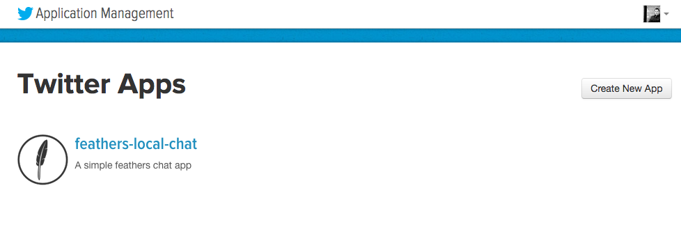
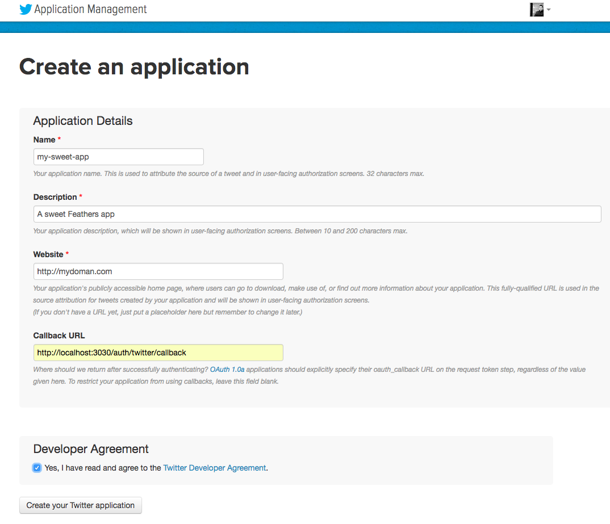

# feathers-authentication-oauth1 Example

This provides a complete working example on how to use `feathers-authentication-oauth1` to provide Twitter authentication and get a JWT access token in return.

1. Create an application on Twitter
    
    
    
    
    

2. Add your `consumerKey` and `consumerSecret` to the app.
3. Start the app by running `npm start`
4. Go to [http://localhost:3030/auth/twitter](http://localhost:3030/auth/twitter) in your browser
