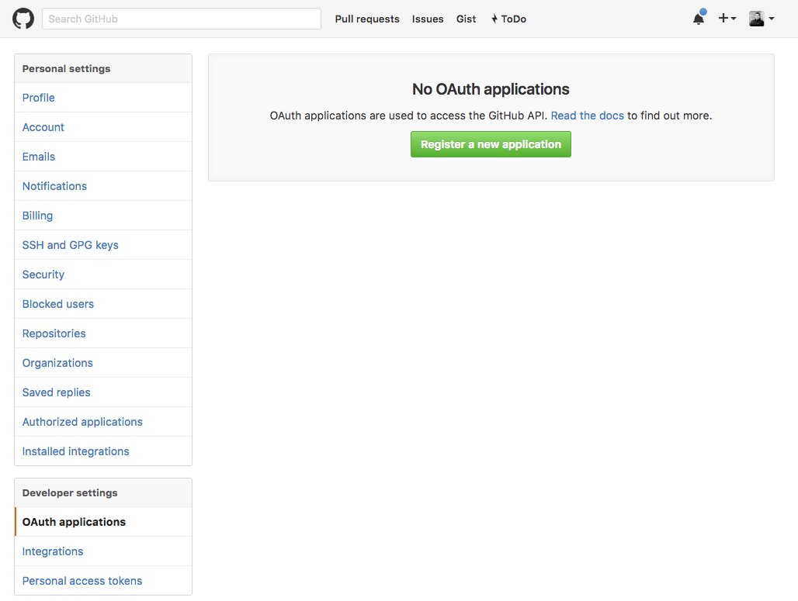
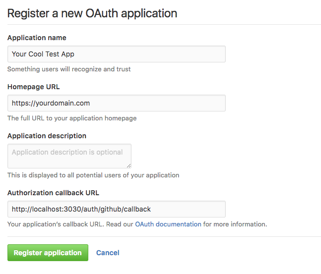

# feathers-authentication-oauth2 Example

This provides a complete working example on how to use `feathers-authentication-oauth2` to provide Github authentication and get a JWT access token in return.

1. Create an application on Github
    
    
    
    
    

2. Add your `clientID` and `clientSecret` to the app.
3. Start the app by running `npm start`
4. Go to [http://localhost:3030/auth/github](http://localhost:3030/auth/github) in your browser
